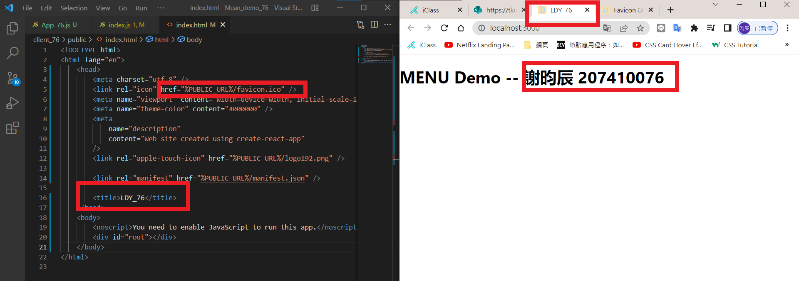
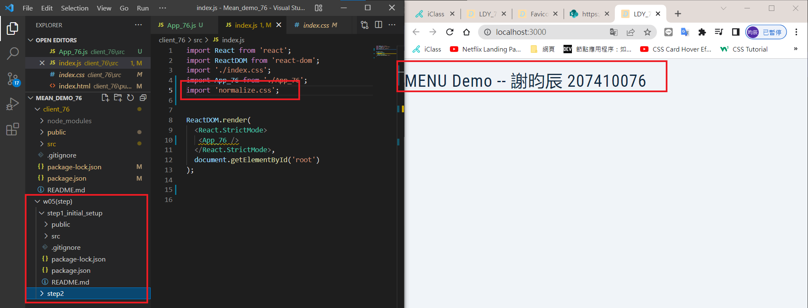
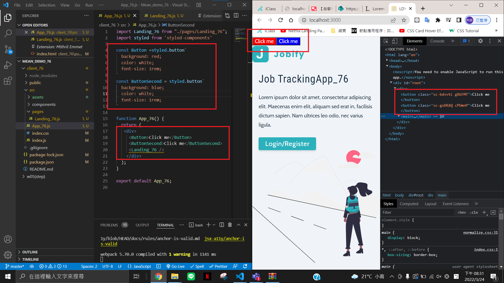
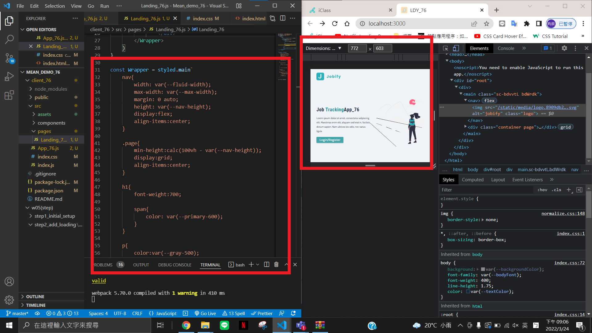
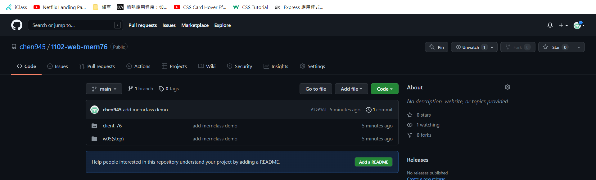
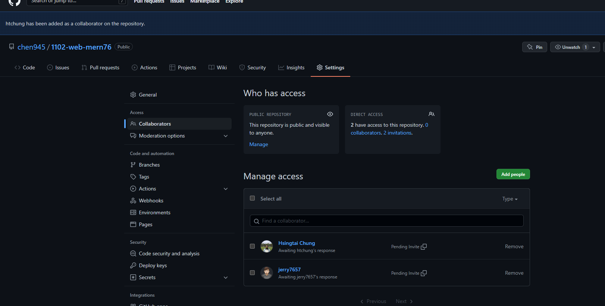

# step1: initial setup

### P1: favicon & title using your English name initials

### P2

# step2:

### P3: styled components demo (2 buttons)

### P4: Landing_xx styled components with Responsive Design

### p5

### p6

